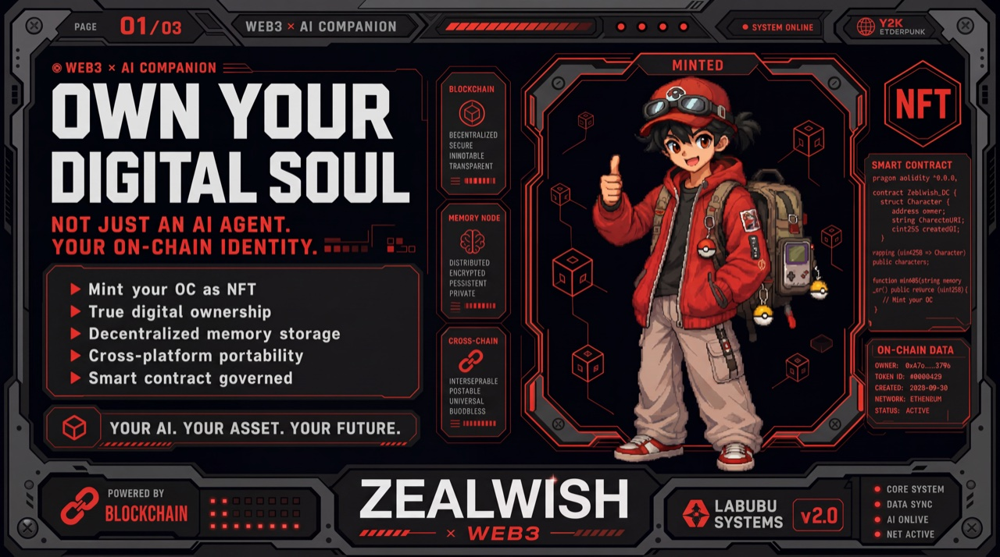
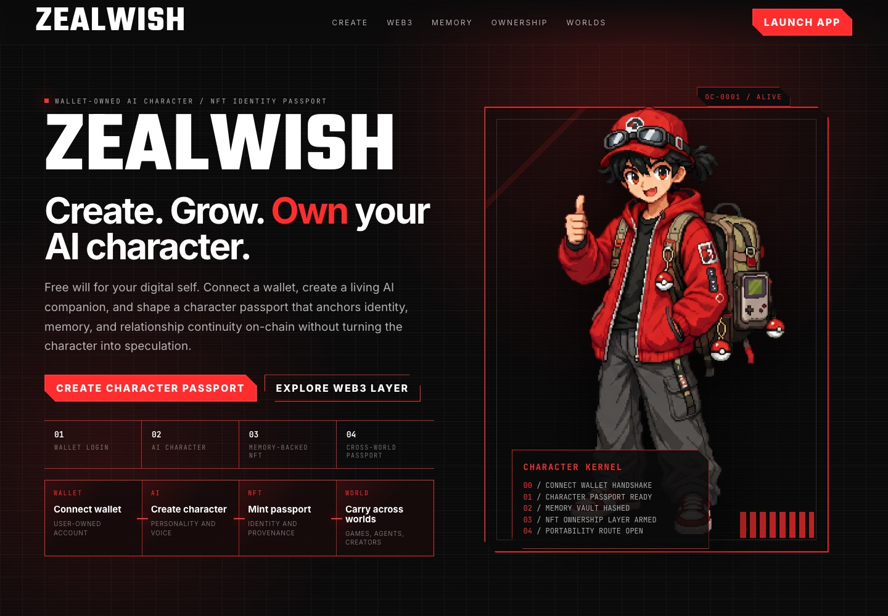
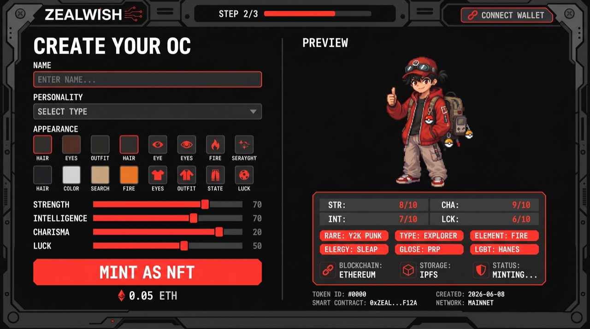
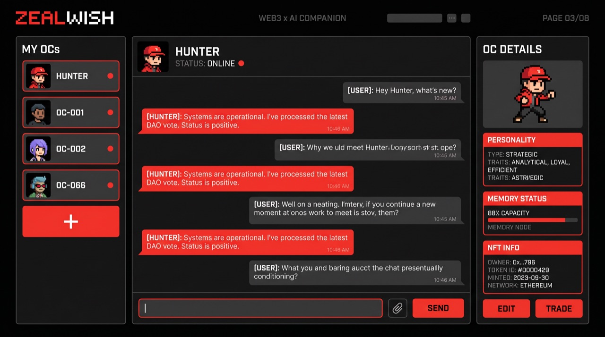
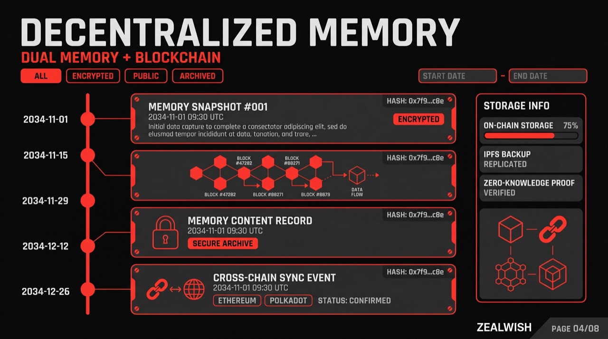
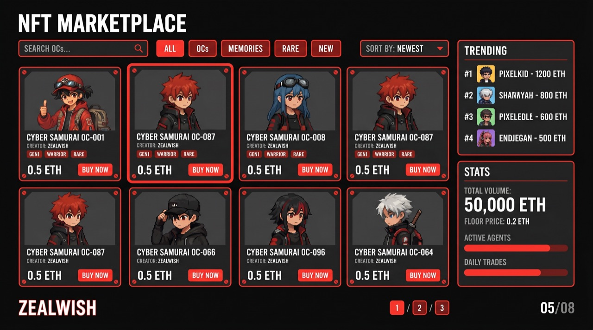
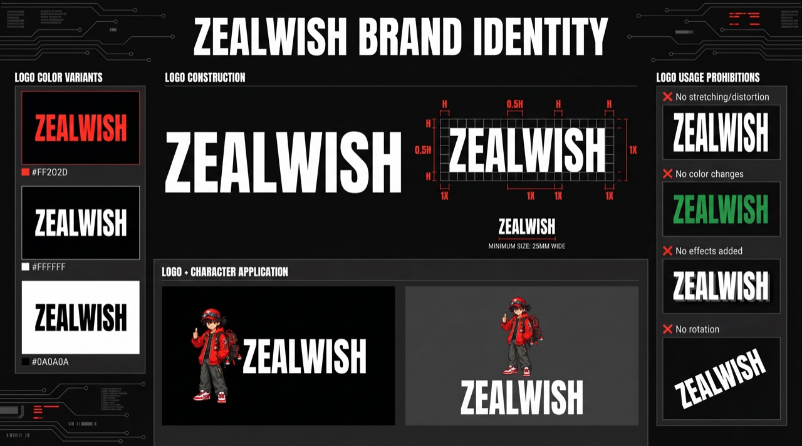
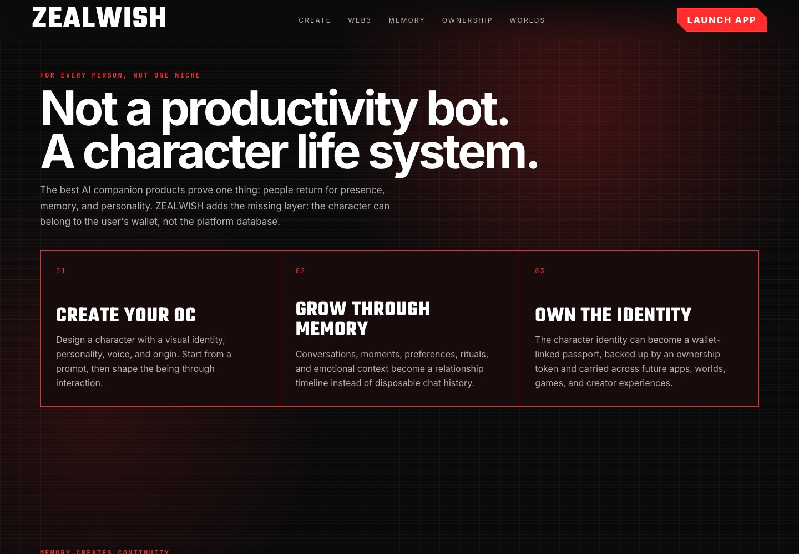
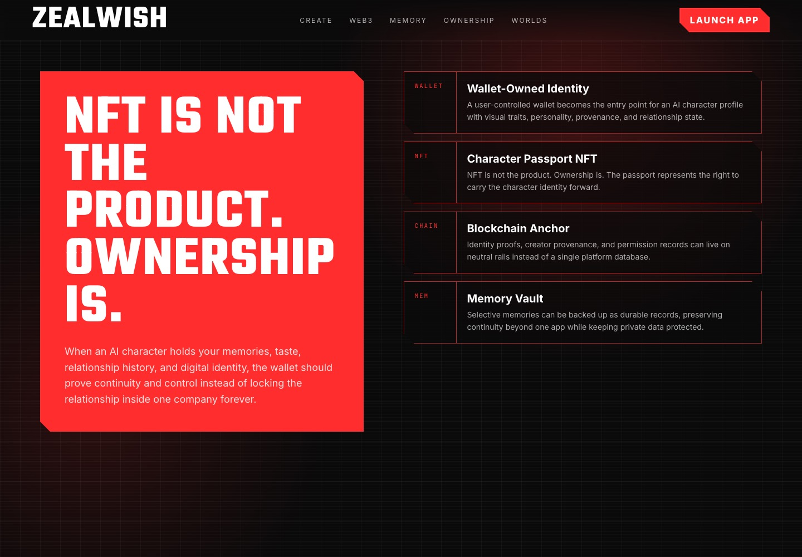
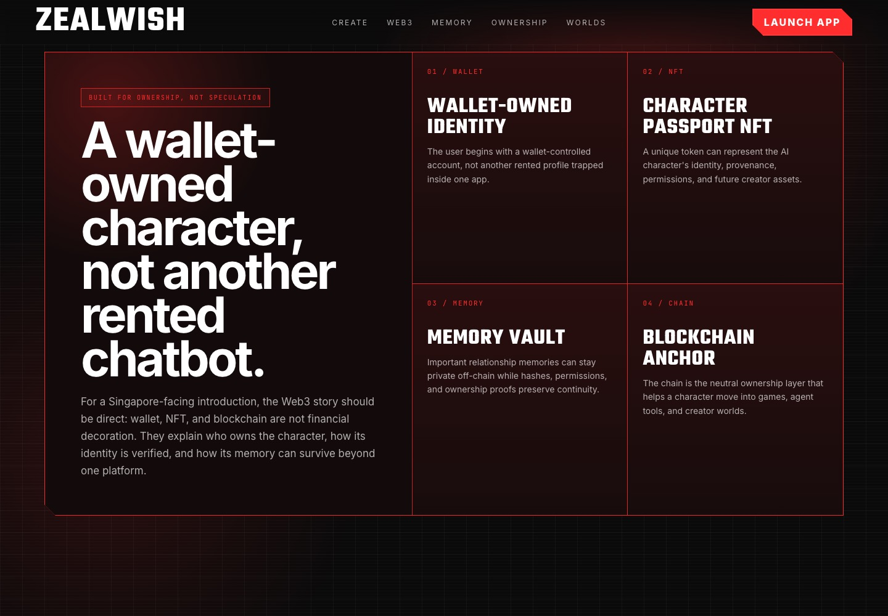

<p align="center">
  
</p>

# ZEALWISH

<p align="center">
  <a href="https://github.com/KINGKAZMAX/OCWORLD-WEB/stargazers"></a>
  <a href="https://github.com/KINGKAZMAX/OCWORLD-WEB/blob/main/LICENSE"></a>
  
  
  
</p>

<p align="center">
  <a href="#what-is-zealwish">What is ZEALWISH?</a> ·
  <a href="#key-features">Features</a> ·
  <a href="#screenshots">Screenshots</a> ·
  <a href="#competitive-positioning">Competitive Edge</a> ·
  <a href="#architecture">Architecture</a> ·
  <a href="#quick-start">Quick Start</a> ·
  <a href="#faq">FAQ</a> ·
  <a href="#roadmap">Roadmap</a>
</p>

---

> **ZEALWISH is the first AI character platform where you create, grow, and truly own a living digital companion — backed by persistent memory and Web3 identity.**
>
> **Ownership is the product.**

---

## What is ZEALWISH?

Today's AI companion market is worth millions — Character.AI has 20M monthly users, Replika has 30M downloads. Yet every platform shares the same flaw: **you don't own what you create.** Your character's personality, memories, and identity live inside a walled garden. Switch apps, and you lose everything.

ZEALWISH introduces the missing layer: **ownership.** Your AI character's identity, memory vault, and provenance are portable, verifiable, and yours.

Three pillars define the product:

- **Create** — A cinematic four-step ritual brings your character to life. Not a form — a moment.
- **Grow** — Every conversation builds persistent memory. Your character remembers, evolves, and deepens over time.
- **Own** — Character identity and memory can be minted as on-chain assets. You hold the keys.

## Key Features

- **Cinematic Character Creation** — A four-step onboarding ritual: ignition → visual style → character prompt → first meeting. Designed as an experience, not a signup flow.
- **Persistent Memory System** — Four-stage intimacy model (Stranger → Familiar → Friend → Intimate) that deepens naturally across conversations. Your character remembers what matters.
- **Ownership Layer (Web3)** — Character identity, memory vault, and provenance tracked on-chain. Users hold the keys to their companion's existence — not a platform.
- **Local AI Runtime (Hermes)** — The Electron desktop app runs a local AI agent, keeping conversations private and on-device by default.
- **Dual-Mode Web App** — A standalone landing page showcases the vision; one click launches the full interactive app shell — no build step, pure CDN.
- **Bilingual Interface** — Full English and Simplified Chinese support with instant language switching.
- **Command Palette (⌘K)** — Fast navigation across all views: Plaza, Talk, Rewind, Record, Settings, and session management.
- **Web3 Character Passport** — Wallet-linked identity that anchors personality, memory, and relationship continuity on-chain. Carry your character across games, agent tools, and creator worlds.

## Screenshots

<p align="center">
  
  
  
  
  
  
</p>

### Web3 Character Passport

<p align="center">
  
  
  
</p>

## Competitive Positioning

| | ZEALWISH | Character.AI | Replika | Kindroid | Nomi.ai |
|---|---|---|---|---|---|
| **Character Creation** | Cinematic ritual | Quick form | Avatar builder | Text prompt | Profile setup |
| **Memory** | Persistent + staged | Session-based | Long-term | Episodic | Conversation |
| **Ownership** | On-chain identity | Platform-locked | Platform-locked | Platform-locked | Platform-locked |
| **Runtime** | Local-first (Hermes) | Cloud only | Cloud only | Cloud only | Cloud only |
| **Data Privacy** | On-device by default | Server-side | Server-side | Server-side | Server-side |
| **Portability** | Cross-world passport | No | No | No | No |

**The gap is ownership.** Every competitor locks your character's identity inside their platform. ZEALWISH makes identity portable.

## Architecture

```
┌──────────────────────────────────────────────────┐
│                  ZEALWISH Desktop                 │
│  ┌─────────────┐  ┌──────────────────────────┐   │
│  │  Electron   │  │   Local AI Runtime       │   │
│  │  Shell      │←→│   (Hermes Agent)         │   │
│  │  (IPC)      │  │   - LLM inference        │   │
│  └──────┬──────┘  │   - TTS / ASR            │   │
│         │         │   - Image generation      │   │
│         │         └──────────────────────────┘   │
│  ┌──────▼──────────────────────────────────┐     │
│  │  React 18 Frontend (Vite)               │     │
│  │  - Character creation & management      │     │
│  │  - Persistent memory & intimacy         │     │
│  │  - Command palette & multi-view         │     │
│  └─────────────────────────────────────────┘     │
├──────────────────────────────────────────────────┤
│  ┌─────────────┐  ┌──────────────────────────┐   │
│  │  Web App    │  │  Ownership Layer         │   │
│  │  (CDN)      │  │  - On-chain identity     │   │
│  │  Landing +  │  │  - Memory vault          │   │
│  │  App Shell  │  │  - Provenance tracking   │   │
│  └─────────────┘  └──────────────────────────┘   │
└──────────────────────────────────────────────────┘
```

## Tech Stack

| Layer | Technology |
|-------|-----------|
| Desktop Runtime | Electron 35 |
| Frontend (Desktop) | React 18 · TypeScript 5.8 · Vite 6 |
| Frontend (Web) | React 18 · Babel Standalone · CDN (zero build) |
| AI Runtime | Hermes Agent (local LLM inference) |
| Memory | Persistent JSON + episode awareness system |
| Ownership | Web3 character passport (planned) |
| Testing | Playwright · Vitest |

## Quick Start

### Web Demo (frontend-v4, zero build)

```bash
cd frontend-v4
python3 -m http.server 8080
# Open http://localhost:8080
```

The web app runs entirely client-side with CDN-loaded React. No build step, no Node.js required.

### Desktop App (Electron)

```bash
git clone https://github.com/KINGKAZMAX/OCWORLD-WEB.git
cd OCWORLD-WEB
npm install
npm run dev
```

## FAQ

**Q: Is ZEALWISH a game or a productivity tool?**
Neither. ZEALWISH is an AI character platform — your companion lives at the edge of your screen, remembers your conversations, and grows with you over time.

**Q: Why Web3? Is this a crypto project?**
No. Web3 is the ownership infrastructure — it ensures your character's identity, memories, and provenance are portable and verifiable. You own what you create. No tokens, no speculation.

**Q: How is this different from Character.AI or Replika?**
Those platforms lock your character inside their ecosystem. ZEALWISH gives you ownership — your character's identity and memory vault are yours, portable across platforms.

**Q: Is my data private?**
Yes. The desktop app runs a local AI runtime (Hermes). Conversations stay on-device by default. The web demo uses fallback responses — no data leaves your browser.

**Q: What stage is the project in?**
Active development for UCWS Singapore Hackathon 2026 (Demo Day: June 13). Core character creation, memory, and intimacy systems are functional. Web3 ownership layer is in design.

## Roadmap

- [x] Character creation ritual (4-step cinematic onboarding)
- [x] Persistent memory with 4-stage intimacy model
- [x] Local AI runtime integration (Hermes)
- [x] Bilingual interface (EN/ZH)
- [x] Web app shell (CDN, zero-build)
- [x] Web3 character passport design
- [ ] Web3 identity minting
- [ ] Memory vault export/import
- [ ] Multi-platform character portability
- [ ] Community marketplace

## Community

<!-- Links will be added soon -->
- Website: _coming soon_
- Discord: _coming soon_

## Status

🚧 **Active Development** — UCWS Singapore Hackathon 2026. Demo Day: June 13, 2026.

## License

Private — All rights reserved.
